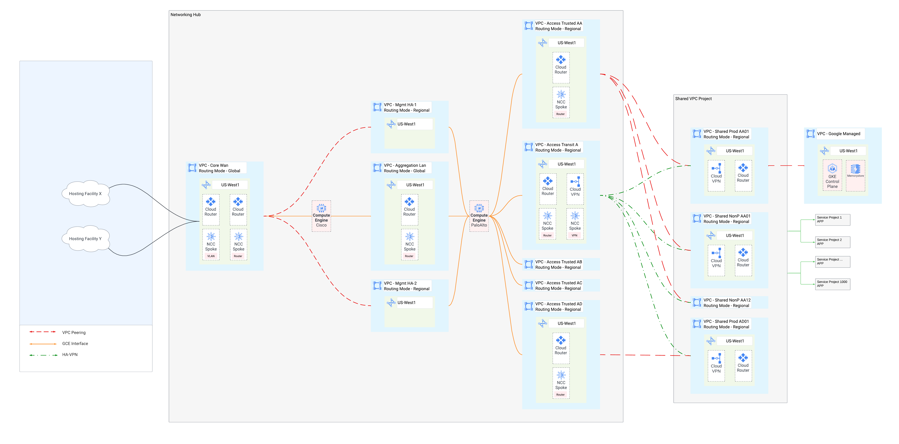

# Overview
This lab will build out an advanced GCP networking 4-tier (Core, Aggregation, Access and Shared) architecture aimed at building a highly scalable environment.
## Core
## Aggregation    
## Access
## Shared

